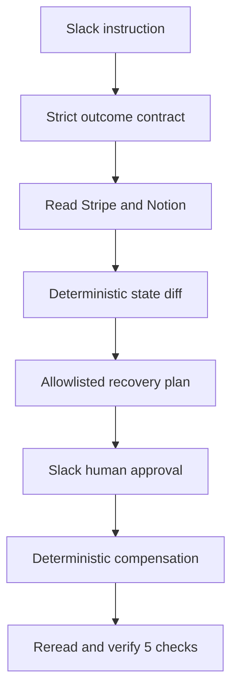

# Architecture — Amends IntentLock

## 1. Architecture objective

Deliver one secure-enough, inspectable hackathon demonstration without building a production platform. The domain core is deterministic; the LLM interprets intent but never executes provider mutations.

## 2. Stack

- Node.js 20.20.2
- npm 10.8.2 with committed `package-lock.json`
- Strict TypeScript
- Next.js 16 App Router
- React, Tailwind CSS, shadcn/ui
- Zod for every external/runtime boundary
- Official Stripe, Notion, and Slack SDKs
- OpenAI API Structured Outputs for `OutcomeContractV1`
- SQLite for local run/audit persistence
- Vitest for unit/integration tests
- Playwright for the golden browser flow
- ChronoMCP pinned to an attributed upstream commit only if Phase 0 gate passes

No Supabase, user billing, ORM, Redis, queue, LangGraph, Composio, Activepieces, or multi-agent framework in P0.

## 3. Trust boundaries

Untrusted inputs include Slack text/actors, model output, request bodies, route parameters, provider payloads, provider IDs, browser state, and ChronoMCP output. Validate and normalize them before use.

Trusted configuration is server-only environment data validated at startup. A configured alias such as `northstar` maps to exact allowlisted provider IDs. The model and browser never supply executable provider identifiers.

## 4. System flow



ChronoMCP, if retained, wraps the mutation boundary between approval and provider execution. It does not create the outcome contract or decide semantic correctness.

## 5. Repository layout

```text
Amends/
├── docs/
│   ├── AI_RULES.md
│   ├── PRD.md
│   ├── Architecture.md
│   ├── plan.md
│   ├── TEAM_SCHEDULE.md
│   ├── DECISIONS.md
│   └── BUILD_LOG.md
├── app/
│   ├── page.tsx
│   ├── runs/[runId]/page.tsx
│   └── api/
│       ├── health/route.ts
│       ├── demo/reset/route.ts
│       ├── demo/fault/route.ts
│       └── runs/[runId]/
│           ├── inspect/route.ts
│           ├── request-approval/route.ts
│           ├── check-approval/route.ts
│           └── execute/route.ts
├── components/
│   ├── incident-header.tsx
│   ├── application-state-card.tsx
│   ├── mismatch-table.tsx
│   ├── recovery-plan.tsx
│   ├── verification-checks.tsx
│   └── audit-timeline.tsx
├── src/
│   ├── domain/
│   │   ├── schemas.ts
│   │   ├── compare.ts
│   │   ├── impact.ts
│   │   ├── plan.ts
│   │   ├── verify.ts
│   │   └── transitions.ts
│   ├── application/
│   │   ├── inspect-run.ts
│   │   ├── approve-run.ts
│   │   └── execute-recovery.ts
│   ├── integrations/
│   │   ├── stripe.ts
│   │   ├── notion.ts
│   │   ├── slack.ts
│   │   └── openai.ts
│   ├── infrastructure/
│   │   ├── db.ts
│   │   ├── env.ts
│   │   ├── audit.ts
│   │   ├── logger.ts
│   │   └── rate-limit.ts
│   └── chrono/
│       ├── adapter.ts
│       └── attribution.ts
├── scripts/
│   ├── reset-demo.ts
│   ├── inject-fault.ts
│   └── golden-run.ts
├── tests/
│   ├── unit/
│   ├── integration/
│   └── e2e/
├── LICENSES/CHRONOMCP_LICENSE
├── .env.example
└── README.md
```

Only create folders when their phase begins.

## 6. Core data contracts

`OutcomeContractV1` contains a version, instruction evidence reference, customer alias, currency, expected Stripe state, expected Notion state, and permitted communication outcome. It uses integer cents and strict enums. Unknown fields are rejected.

`NormalizedStateV1` contains sanitized Stripe, Notion, and Slack evidence with timestamps. Raw SDK responses are never stored or returned to the browser.

`RecoveryPlanV1` contains run ID, ordered actions, risk/reversibility labels, preconditions, expiration, and SHA-256 hash of canonical JSON.

Allowed action union:

```ts
type RecoveryAction =
  | { type: 'RESTORE_STRIPE_GRANDFATHERED_PRICE'; customerAlias: 'northstar'; unitAmount: 9900; quantity: 87 }
  | { type: 'RESTORE_NOTION_PRICING_POLICY'; scope: 'new_customers_only'; existingAmount: 9900; newAmount: 12900 }
  | { type: 'POST_SLACK_RECOVERY_RECEIPT'; runCode: string };
```

## 7. Run states

```text
CREATED → INSPECTING → MISMATCH_FOUND → APPROVAL_PENDING → APPROVED
→ RECOVERING → VERIFYING → VERIFIED
```

Terminal/failure states: `NO_MISMATCH`, `MANUAL_REVIEW`, `INSPECTION_FAILED`, `APPROVAL_DENIED`, `PLAN_EXPIRED`, `RECOVERY_PARTIAL`, `VERIFICATION_FAILED`.

Every transition is enforced by deterministic code and appended to the audit ledger.

## 8. Persistence

Use one local SQLite database with three tables:

- `runs`: sanitized contract/state/plan projections, status, plan hash, version, timestamps.
- `actions`: action type, stable idempotency key, preconditions, status, sanitized result reference.
- `audit_events`: append-only sequence, run ID, event type, sanitized metadata, timestamp.

No multi-tenancy. Bind the web server to `127.0.0.1` by default. If a public tunnel is required for Slack webhooks, expose only the minimum callback route with signature verification; otherwise use bounded Slack polling and no inbound public webhook.

## 9. Provider adapters

### Stripe

- Test key/object assertion before every mutation.
- Resolve `northstar` through server configuration.
- Explicitly preserve quantity `87` and disable proration.
- Read before, check preconditions, mutate with idempotency key, reread.
- Capture invoice fingerprint before/after to verify no recovery invoice/proration.

### Notion

- Integration has access only to the synthetic demo resource.
- Update only three named properties with validated property IDs/types.
- Read before, check preconditions, update, reread.

### Slack

- Bot is limited to the synthetic channel.
- Read bounded messages/replies.
- Approval requires exact configured actor and exact current run code.
- Post one approval request and one recovery receipt per run.

## 10. API controls

Routes are POST unless health/read projection requires GET. Validate content type, body size, CSRF/origin for browser mutations, Zod schema, run state, optimistic version, and request rate. Rate limit by IP and run ID with local in-memory limits because the server is single-instance/local. Return graceful `429` with `Retry-After`.

Do not rely on a secret URL. Public deployment is out of scope unless organizers require it and proper authentication is added as an explicit decision.

## 11. Observability

Use structured JSON logs with request ID, run ID, state, action type, provider, duration, and sanitized error code. Never log headers, tokens, full provider payloads, full Slack content, or raw model prompts/responses.

The judge-facing audit timeline is derived from sanitized audit events—not fabricated animation.

## 12. Verification and testing

- Unit: schema rejection, money, comparison, plan, hash, transitions, five checks.
- Integration: adapter normalization, test-mode protection, preconditions, idempotency, approval parsing.
- Golden E2E: reset → fault → inspect → approve → execute → verify.
- Failure drills: malformed model output, wrong approver, expired plan, repeated execute, changed precondition, provider timeout.

Real integrations are required for the live golden path. Provider SDKs may be faked only in automated tests and must be labeled.
